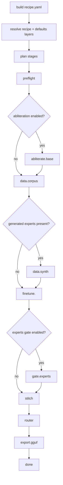
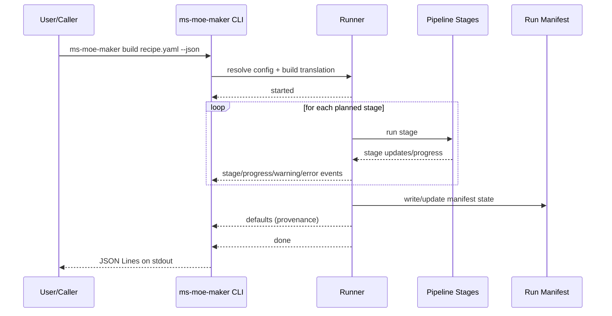

# Architecture

## High-level shape

`ms-moe-maker` is a contract-first CLI pipeline. The user-facing contract is:

1. command vocabulary (`describe`, `build`, `validate`, etc.)
2. stage vocabulary (`preflight`, `data.corpus`, ...)
3. JSON event vocabulary under `--json`
4. run manifest schema compatibility

## Stage model

Stage IDs are defined in `ms_moe_maker/stages.py` and are public contract values.

Fixed stages:

- `preflight`
- `abliterate.base` (optional)
- `data.corpus`
- `data.synth` (when generated experts exist)
- `gate.experts` (when enabled)
- `stitch`
- `router`
- `export.gguf`

Per-expert stages:

- `finetune.<expert_name>`

Order is meaningful and used by downstream readers.

## Sequence diagram: build stage flow

## Sequence diagram: JSON event flow (`--json`)

## CLI and compatibility

- Canonical command/mode/event lists live in `ms_moe_maker/_describe.py`.
- `--describe` is designed to answer with minimal side effects.
- Additive change policy: adding commands/modes/events can be compatible; renaming/removing is breaking for downstream consumers.

## Defaults model

Defaults are layered data (floor + packaged + user + explicit + recipe wins).
This supports reproducibility while allowing machine-specific tuning.

## Integration boundaries

- `README.md`: fast path for users
- `docs/CLI.md`: command semantics
- `docs/TROUBLESHOOTING.md`: failure signatures and fixes
- `docs/SOURCE_OF_TRUTH.md`: anti-drift ownership map
